# LAB JUNIPER – BGP (iBGP, eBGP) + IS-IS + POLICY IMPORT/EXPORT

## 2. Mục tiêu

1. Triển khai IS-IS Level 2 làm IGP trong AS 65000.
2. Thiết lập iBGP full-mesh giữa R1, R2 và R3 bằng địa chỉ loopback.
3. Thiết lập eBGP giữa R3 thuộc AS 65000 và ISP-R1 thuộc AS 65001.
4. Sử dụng routing policy để:
   - Chỉ quảng bá `10.10.10.0/24` và `10.10.20.0/24` từ AS 65000 ra ISP.
   - Không quảng bá `10.10.30.0/24` ra ISP.
   - Chỉ nhận `8.8.8.0/24` từ ISP vào AS 65000.
   - Từ chối các route khác từ ISP.
5. Kiểm tra các route được import và export đúng theo policy.

---

## 3. Topology

### 3.1. Ảnh topology

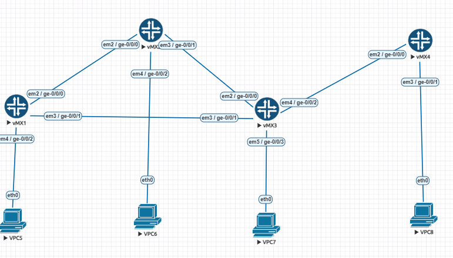


## 4. Kế hoạch địa chỉ IP

### 4.1. Đường kết nối router

| Link | Thiết bị | Interface | Địa chỉ IP |
|---|---|---|---|
| R1 – R2 | R1 | ge-0/0/0.0 | 192.168.1.1/30 |
| R1 – R2 | R2 | ge-0/0/0.0 | 192.168.1.2/30 |
| R2 – R3 | R2 | ge-0/0/1.0 | 192.168.2.1/30 |
| R2 – R3 | R3 | ge-0/0/0.0 | 192.168.2.2/30 |
| R1 – R3 | R1 | ge-0/0/1.0 | 192.168.3.1/30 |
| R1 – R3 | R3 | ge-0/0/1.0 | 192.168.3.2/30 |
| R3 – ISP-R1 | R3 | ge-0/0/2.0 | 192.168.12.1/30 |
| R3 – ISP-R1 | ISP-R1 | ge-0/0/0.0 | 192.168.12.2/30 |

### 4.2. Loopback

| Router | Loopback | AS |
|---|---:|---:|
| R1 | 1.1.1.1/32 | 65000 |
| R2 | 2.2.2.2/32 | 65000 |
| R3 | 3.3.3.3/32 | 65000 |
| ISP-R1 | 10.10.10.10/32 | 65001 |

### 4.3. Mạng LAN

| LAN | Router | Gateway | PC |
|---|---|---|---|
| LAN A | R1 | 10.10.10.1/24 | 10.10.10.100/24 |
| LAN B | R2 | 10.10.20.1/24 | 10.10.20.100/24 |
| LAN C | R3 | 10.10.30.1/24 | 10.10.30.100/24 |
| Internet giả lập | ISP-R1 | 8.8.8.1/24 | 8.8.8.8/24 |

---

# 5. Cấu hình R1

```junos
configure

set system host-name R1

set interfaces lo0 unit 0 family inet address 1.1.1.1/32
set interfaces lo0 unit 0 family iso address 49.0001.0000.0000.0001.00

set interfaces ge-0/0/0 description TO-R2
set interfaces ge-0/0/0 unit 0 family inet address 192.168.1.1/30
set interfaces ge-0/0/0 unit 0 family iso

set interfaces ge-0/0/1 description TO-R3
set interfaces ge-0/0/1 unit 0 family inet address 192.168.3.1/30
set interfaces ge-0/0/1 unit 0 family iso

set interfaces ge-0/0/3 description TO-PC-A
set interfaces ge-0/0/3 unit 0 family inet address 10.10.10.1/24

set routing-options router-id 1.1.1.1
set routing-options autonomous-system 65000

set protocols isis level 1 disable
set protocols isis level 2 wide-metrics-only
set protocols isis interface ge-0/0/0.0 point-to-point
set protocols isis interface ge-0/0/0.0 level 2 metric 10
set protocols isis interface ge-0/0/1.0 point-to-point
set protocols isis interface ge-0/0/1.0 level 2 metric 10
set protocols isis interface lo0.0 passive

set policy-options policy-statement EXPORT-R1-IBGP term LAN-A from protocol direct
set policy-options policy-statement EXPORT-R1-IBGP term LAN-A from route-filter 10.10.10.0/24 exact
set policy-options policy-statement EXPORT-R1-IBGP term LAN-A then accept
set policy-options policy-statement EXPORT-R1-IBGP term REJECT-REST then reject

set protocols bgp group IBGP type internal
set protocols bgp group IBGP local-address 1.1.1.1
set protocols bgp group IBGP family inet unicast
set protocols bgp group IBGP peer-as 65000
set protocols bgp group IBGP export EXPORT-R1-IBGP
set protocols bgp group IBGP neighbor 2.2.2.2
set protocols bgp group IBGP neighbor 3.3.3.3

commit check
commit
```


# 6. Cấu hình R2

```junos
configure

set system host-name R2

set interfaces lo0 unit 0 family inet address 2.2.2.2/32
set interfaces lo0 unit 0 family iso address 49.0001.0000.0000.0002.00

set interfaces ge-0/0/0 description TO-R1
set interfaces ge-0/0/0 unit 0 family inet address 192.168.1.2/30
set interfaces ge-0/0/0 unit 0 family iso

set interfaces ge-0/0/1 description TO-R3
set interfaces ge-0/0/1 unit 0 family inet address 192.168.2.1/30
set interfaces ge-0/0/1 unit 0 family iso

set interfaces ge-0/0/3 description TO-PC-B
set interfaces ge-0/0/3 unit 0 family inet address 10.10.20.1/24

set routing-options router-id 2.2.2.2
set routing-options autonomous-system 65000

set protocols isis level 1 disable
set protocols isis level 2 wide-metrics-only
set protocols isis interface ge-0/0/0.0 point-to-point
set protocols isis interface ge-0/0/0.0 level 2 metric 10
set protocols isis interface ge-0/0/1.0 point-to-point
set protocols isis interface ge-0/0/1.0 level 2 metric 10
set protocols isis interface lo0.0 passive

set policy-options policy-statement EXPORT-R2-IBGP term LAN-B from protocol direct
set policy-options policy-statement EXPORT-R2-IBGP term LAN-B from route-filter 10.10.20.0/24 exact
set policy-options policy-statement EXPORT-R2-IBGP term LAN-B then accept
set policy-options policy-statement EXPORT-R2-IBGP term REJECT-REST then reject

set protocols bgp group IBGP type internal
set protocols bgp group IBGP local-address 2.2.2.2
set protocols bgp group IBGP family inet unicast
set protocols bgp group IBGP peer-as 65000
set protocols bgp group IBGP export EXPORT-R2-IBGP
set protocols bgp group IBGP neighbor 1.1.1.1
set protocols bgp group IBGP neighbor 3.3.3.3

commit check
commit
```


# 7. Cấu hình R3

```junos
configure

set system host-name R3

set interfaces lo0 unit 0 family inet address 3.3.3.3/32
set interfaces lo0 unit 0 family iso address 49.0001.0000.0000.0003.00

set interfaces ge-0/0/0 description TO-R2
set interfaces ge-0/0/0 unit 0 family inet address 192.168.2.2/30
set interfaces ge-0/0/0 unit 0 family iso

set interfaces ge-0/0/1 description TO-R1
set interfaces ge-0/0/1 unit 0 family inet address 192.168.3.2/30
set interfaces ge-0/0/1 unit 0 family iso

set interfaces ge-0/0/2 description TO-ISP-R1
set interfaces ge-0/0/2 unit 0 family inet address 192.168.12.1/30

set interfaces ge-0/0/3 description TO-PC-C
set interfaces ge-0/0/3 unit 0 family inet address 10.10.30.1/24

set routing-options router-id 3.3.3.3
set routing-options autonomous-system 65000

set protocols isis level 1 disable
set protocols isis level 2 wide-metrics-only
set protocols isis interface ge-0/0/0.0 point-to-point
set protocols isis interface ge-0/0/0.0 level 2 metric 10
set protocols isis interface ge-0/0/1.0 point-to-point
set protocols isis interface ge-0/0/1.0 level 2 metric 10
set protocols isis interface lo0.0 passive

set policy-options policy-statement EXPORT-R3-IBGP term INTERNET from protocol bgp
set policy-options policy-statement EXPORT-R3-IBGP term INTERNET from route-filter 8.8.8.0/24 exact
set policy-options policy-statement EXPORT-R3-IBGP term INTERNET then next-hop self
set policy-options policy-statement EXPORT-R3-IBGP term INTERNET then accept

set policy-options policy-statement EXPORT-R3-IBGP term LAN-C from protocol direct
set policy-options policy-statement EXPORT-R3-IBGP term LAN-C from route-filter 10.10.30.0/24 exact
set policy-options policy-statement EXPORT-R3-IBGP term LAN-C then accept

set policy-options policy-statement EXPORT-R3-IBGP term REJECT-REST then reject

set policy-options policy-statement EXPORT-TO-ISP term LAN-A from route-filter 10.10.10.0/24 exact
set policy-options policy-statement EXPORT-TO-ISP term LAN-A then accept

set policy-options policy-statement EXPORT-TO-ISP term LAN-B from route-filter 10.10.20.0/24 exact
set policy-options policy-statement EXPORT-TO-ISP term LAN-B then accept

set policy-options policy-statement EXPORT-TO-ISP term REJECT-REST then reject

set policy-options policy-statement IMPORT-FROM-ISP term INTERNET from route-filter 8.8.8.0/24 exact
set policy-options policy-statement IMPORT-FROM-ISP term INTERNET then accept
set policy-options policy-statement IMPORT-FROM-ISP term REJECT-REST then reject

set protocols bgp group IBGP type internal
set protocols bgp group IBGP local-address 3.3.3.3
set protocols bgp group IBGP family inet unicast
set protocols bgp group IBGP peer-as 65000
set protocols bgp group IBGP export EXPORT-R3-IBGP
set protocols bgp group IBGP neighbor 1.1.1.1
set protocols bgp group IBGP neighbor 2.2.2.2

set protocols bgp group EBGP-ISP type external
set protocols bgp group EBGP-ISP local-address 192.168.12.1
set protocols bgp group EBGP-ISP family inet unicast
set protocols bgp group EBGP-ISP peer-as 65001
set protocols bgp group EBGP-ISP import IMPORT-FROM-ISP
set protocols bgp group EBGP-ISP export EXPORT-TO-ISP
set protocols bgp group EBGP-ISP neighbor 192.168.12.2

commit check
commit
```


# 8. Cấu hình ISP-R1

```junos
configure

set system host-name ISP-R1

set interfaces lo0 unit 0 family inet address 10.10.10.10/32

set interfaces ge-0/0/0 description TO-R3
set interfaces ge-0/0/0 unit 0 family inet address 192.168.12.2/30

set interfaces ge-0/0/1 description TO-PC-INTERNET
set interfaces ge-0/0/1 unit 0 family inet address 8.8.8.1/24

set routing-options router-id 10.10.10.10
set routing-options autonomous-system 65001

set policy-options policy-statement EXPORT-TO-AS65000 term INTERNET from protocol direct
set policy-options policy-statement EXPORT-TO-AS65000 term INTERNET from route-filter 8.8.8.0/24 exact
set policy-options policy-statement EXPORT-TO-AS65000 term INTERNET then accept

set policy-options policy-statement EXPORT-TO-AS65000 term TEST-LOOPBACK from protocol direct
set policy-options policy-statement EXPORT-TO-AS65000 term TEST-LOOPBACK from route-filter 10.10.10.10/32 exact
set policy-options policy-statement EXPORT-TO-AS65000 term TEST-LOOPBACK then accept

set policy-options policy-statement EXPORT-TO-AS65000 term REJECT-REST then reject

set policy-options policy-statement IMPORT-FROM-AS65000 term LAN-A from route-filter 10.10.10.0/24 exact
set policy-options policy-statement IMPORT-FROM-AS65000 term LAN-A then accept

set policy-options policy-statement IMPORT-FROM-AS65000 term LAN-B from route-filter 10.10.20.0/24 exact
set policy-options policy-statement IMPORT-FROM-AS65000 term LAN-B then accept

set policy-options policy-statement IMPORT-FROM-AS65000 term REJECT-REST then reject

set protocols bgp group AS65000 type external
set protocols bgp group AS65000 local-address 192.168.12.2
set protocols bgp group AS65000 family inet unicast
set protocols bgp group AS65000 peer-as 65000
set protocols bgp group AS65000 import IMPORT-FROM-AS65000
set protocols bgp group AS65000 export EXPORT-TO-AS65000
set protocols bgp group AS65000 neighbor 192.168.12.1

commit check
commit
```


# 9. Cấu hình VPCS

## 9.1. PC-A

```text
ip 10.10.10.100/24 10.10.10.1
save
```

## 9.2. PC-B

```text
ip 10.10.20.100/24 10.10.20.1
save
```

## 9.3. PC-C

```text
ip 10.10.30.100/24 10.10.30.1
save
```

## 9.4. PC-INTERNET

```text
ip 8.8.8.8/24 8.8.8.1
save
```

# 10. Kiểm tra trạng thái interface

Thực hiện trên R1, R2, R3 và ISP-R1:

```junos
show interfaces terse | match "ge-0/0|lo0"
show configuration interfaces | display set
```

- `show interfaces terse | match "ge-0/0|lo0"`: xem nhanh cổng và loopback đang `up` hay `down`.
- `show configuration interfaces | display set`: xem IP và cấu hình interface theo dạng lệnh `set`.

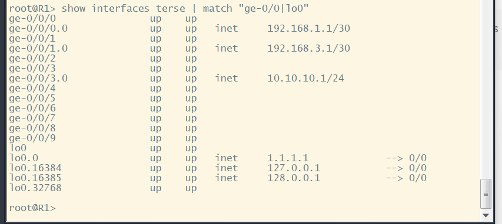

---

# 11. IS-IS Level 2 chạy trên các link nội bộ

Thực hiện trên R1, R2 và R3:

```junos
show isis interface
show isis adjacency
show isis database
show route protocol isis
```

- `show isis interface`: xem interface nào đang chạy IS-IS.
- `show isis adjacency`: xem neighbor IS-IS đã lên chưa.
- `show isis database`: xem database IS-IS có đủ router không.
- `show route protocol isis`: xem route học được từ IS-IS.

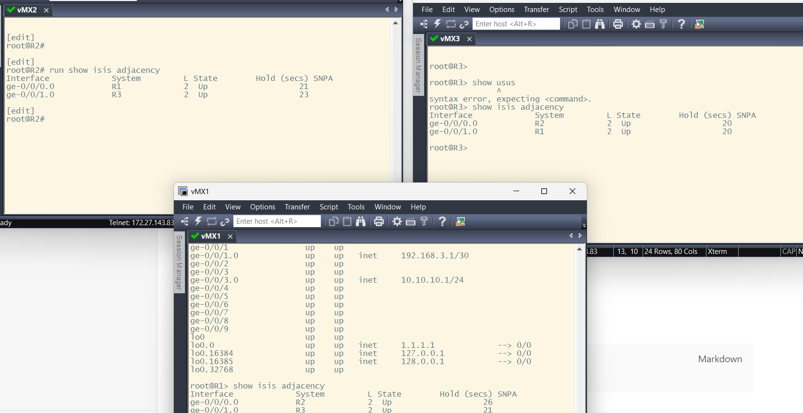

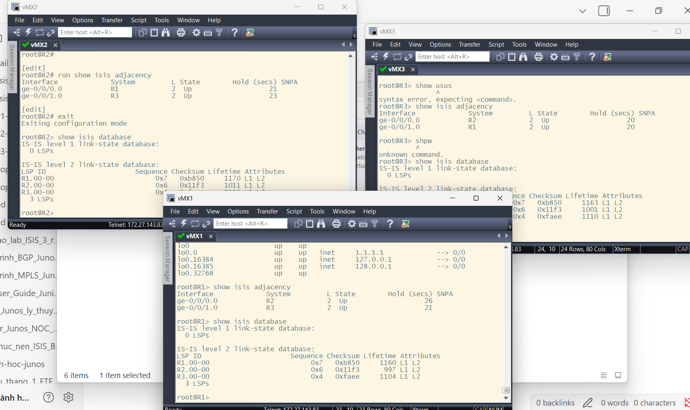

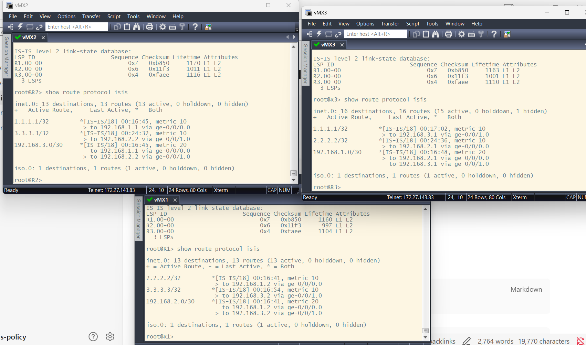

---

# 12. iBGP full-mesh và eBGP đã Established

Thực hiện trên R1, R2, R3 và ISP-R1:

```junos
show bgp summary
show bgp neighbor <dia-chi-neighbor>
```

- `show bgp summary`: xem nhanh các phiên BGP đã Established chưa.
- `show bgp neighbor <dia-chi-neighbor>`: xem chi tiết một neighbor BGP.

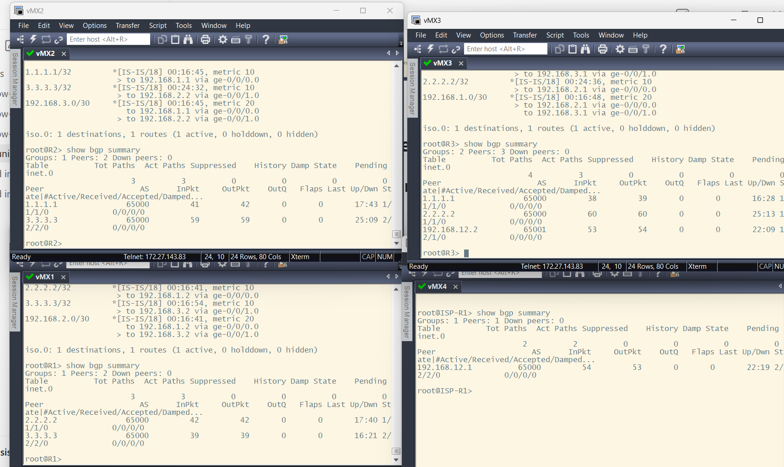

---

# 13. Route BGP học đúng trên từng router

## 13.1. Trên R1

```junos
show route protocol bgp
```

- `show route protocol bgp`: xem các route R1 học bằng BGP.

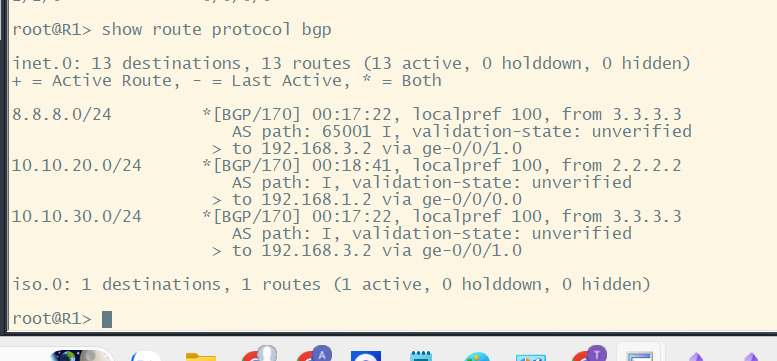

## 13.2. Trên ISP-R1

```junos
show route protocol bgp
show route 10.10.10.0/24 exact
show route 10.10.20.0/24 exact
show route 10.10.30.0/24 exact
```

- `show route protocol bgp`: xem route BGP trên ISP-R1.
- `show route ... exact`: kiểm tra chính xác từng prefix LAN.

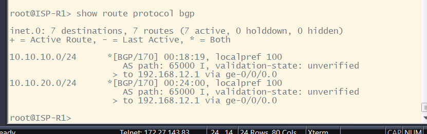

---

# 14. Policy export từ R3 ra ISP

Thực hiện trên R3:

```junos
show configuration policy-options policy-statement EXPORT-TO-ISP | display set
show route advertising-protocol bgp 192.168.12.2
```

- `show configuration policy-options policy-statement EXPORT-TO-ISP | display set`: xem policy export từ R3 ra ISP.
- `show route advertising-protocol bgp 192.168.12.2`: xem R3 đang gửi route nào cho ISP-R1.

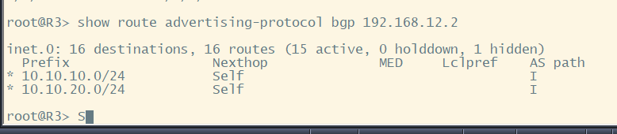

---

# 15. Policy import từ ISP vào R3

## 15.1. ISP-R1 quảng bá route sang R3

Thực hiện trên ISP-R1:

```junos
show configuration policy-options policy-statement EXPORT-TO-AS65000 | display set
show route advertising-protocol bgp 192.168.12.1
```

- `show configuration policy-options policy-statement EXPORT-TO-AS65000 | display set`: xem policy export trên ISP-R1.
- `show route advertising-protocol bgp 192.168.12.1`: xem ISP-R1 đang gửi route nào về R3.

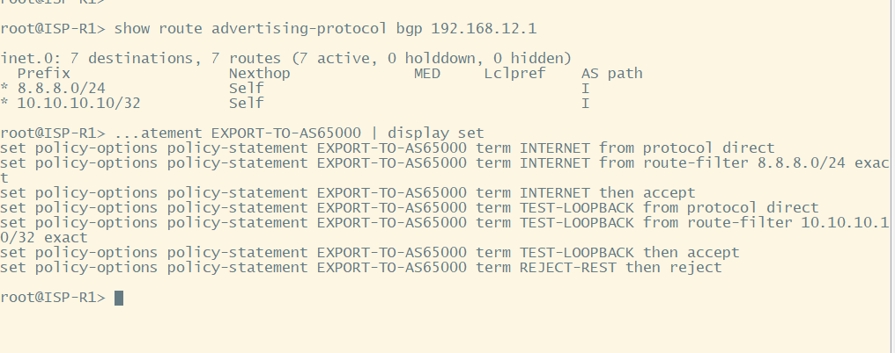

## 15.2. R3 chỉ nhận route hợp lệ từ ISP

Thực hiện trên R3:

```junos
show configuration policy-options policy-statement IMPORT-FROM-ISP | display set
show route receive-protocol bgp 192.168.12.2
show route receive-protocol bgp 192.168.12.2 hidden
show route 8.8.8.0/24 exact
show route 10.10.10.10/32 exact
```

- `show configuration policy-options policy-statement IMPORT-FROM-ISP | display set`: xem policy import từ ISP vào R3.
- `show route receive-protocol bgp 192.168.12.2`: xem route R3 nhận từ ISP-R1.
- `show route receive-protocol bgp 192.168.12.2 hidden`: xem route bị ẩn hoặc bị policy chặn.
- `show route ... exact`: kiểm tra đúng prefix cần xem trong bảng route.

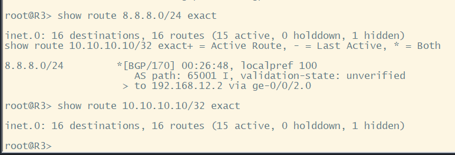

---

# 16. Next-hop self cho route Internet

Thực hiện trên R1 hoặc R2:

```junos
show route 8.8.8.0/24 exact detail
show route 3.3.3.3/32 exact
```

- `show route 8.8.8.0/24 exact detail`: xem chi tiết route Internet và next-hop.
- `show route 3.3.3.3/32 exact`: kiểm tra route đến loopback R3.

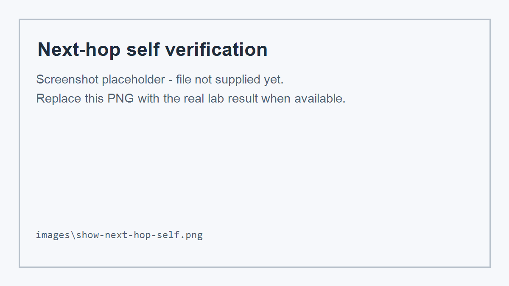

---

# 17. Kiểm tra ping theo policy

## 17.2. PC-B truy cập Internet

```text
ping 8.8.8.8
```

- `ping 8.8.8.8`: kiểm tra PC-B đi được tới mạng Internet giả lập hay chưa.

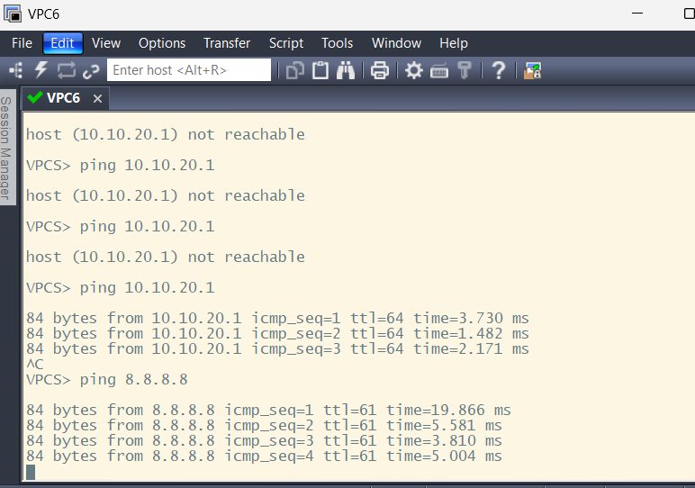

## 17.3. PC-C truy cập Internet

```text
ping 8.8.8.8
```

- `ping 8.8.8.8`: kiểm tra PC-C bị chặn đúng theo policy của bài lab.

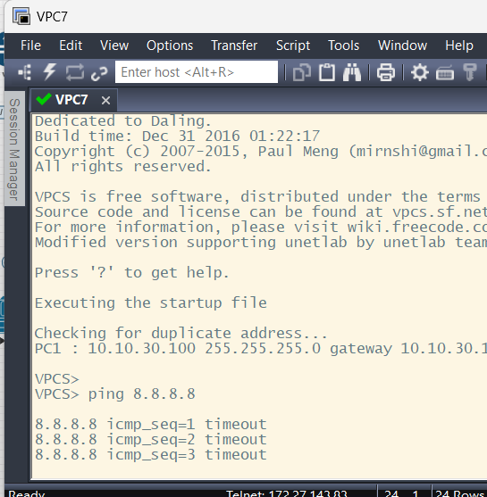
